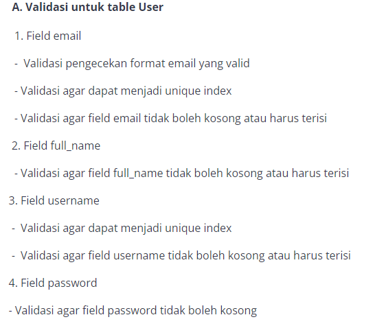
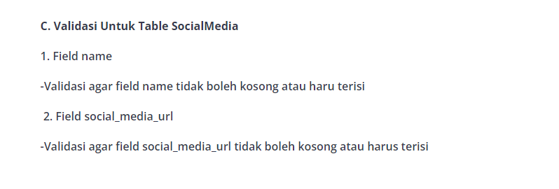

# Final Project 2 - My Gram
**Deadline 17 November 2023, pukul 23:59 WIB**

**Requirment:**

1. Project ini harus dikerjakan menggunakan **ORM Sequalize** dengang database **postgresql**.
2. Package/library yang perlu diisntall
    - [jwt](https://www.npmjs.com/package/jsonwebtoken) 
    - [bcrypt](https://www.npmjs.com/package/bcrypt) 
    - [dotenv](https://www.npmjs.com/package/dotenv) 
    - [express](https://www.npmjs.com/package/express) 
    - [sequalize](https://www.npmjs.com/package/sequelize) 
    - [sequalize-cli](https://www.npmjs.com/package/sequelize-cli) 
3. Dalam project ini memerlukan 4 tabel
   
    **User**

        - id (Primary key)
        - full_name (String/ varchar)
        - email (String/ varchar)
        - username (String/ varchar)
        - password (String/ varchar)
        - profile_image_url (Text)
        - age (number/ integer)
        - phone_number (String/ varchar)
        - createdAt (date)
        - updatedAt (date)
    **Photo**

        - id (Primary key)
        - title (string/varchar)
        - caption (text)
        - poster_image_url (text)
        - UserId (Forgen key Of User Table)
        - createAt (Date)
        - updateAt (Date)
    **comment**

        - id (primary key)
        - UserId (foreign key of user table)
        - comment (text)
        - ceartedAt(date)
        - updatedAt(date)
    **sosialmedia**

        - id (primary key)
        - name (string/varchar)
        - sosial_media_url(string/text)
        - UserId (foreign key of user table)

4. keempat table harus mempunyai validasi disetaip fieldnya
   
    
    
    
    
    
    
5. POST /comments tidak perlu autorisasi, artinya setiap user bisa comment di photo milik user lain
6. GET /comments perlu autorisasi, artinya dia bisa melihat semua comments milik dia sendiri saja
7. POST /socialmedias tidak perlu autorisasi, hanya autentikasi
8.  DELETE /socialmedias/:socialMediaId perlu autentikasi dan autorisasi 
9.  **Wajib di deploy ke railway**

**Deadline 17 November 2023, pukul 23:59 WIB**