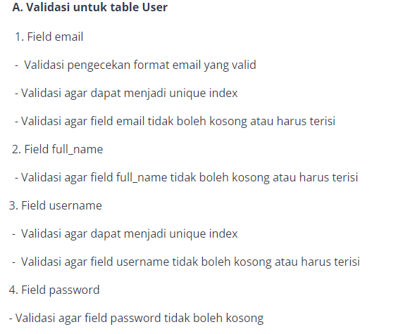
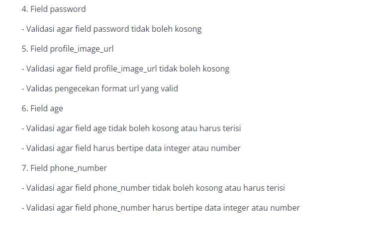
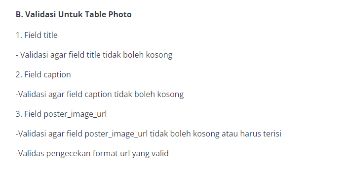
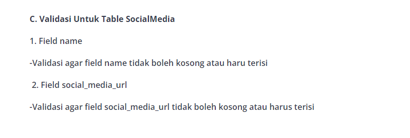
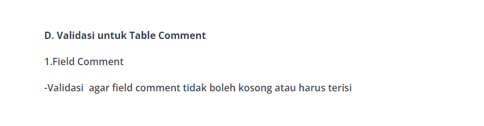

# Final Project 2 - My Gram


link railway : [my gram api](https://final-project2-production.up.railway.app/)

**Deadline 17 November 2023, pukul 23:59 WIB**

**Requirment:**

1. Project ini harus dikerjakan menggunakan **ORM Sequalize** dengang database **postgresql**.
2. Package/library yang perlu diisntall
    - [jwt](https://www.npmjs.com/package/jsonwebtoken) 
    - [bcrypt](https://www.npmjs.com/package/bcrypt) 
    - [dotenv](https://www.npmjs.com/package/dotenv) 
    - [express](https://www.npmjs.com/package/express) 
    - [sequalize](https://www.npmjs.com/package/sequelize) 
    - [sequalize-cli](https://www.npmjs.com/package/sequelize-cli) 
3. Dalam project ini memerlukan 4 tabel
   
    **User**

        - id (Primary key)
        - full_name (String/ varchar)
        - email (String/ varchar)
        - username (String/ varchar)
        - password (String/ varchar)
        - profile_image_url (Text)
        - age (number/ integer)
        - phone_number (String/ varchar)
        - createdAt (date)
        - updatedAt (date)
    **Photo**

        - id (Primary key)
        - title (string/varchar)
        - caption (text)
        - poster_image_url (text)
        - UserId (Forgen key Of User Table)
        - createAt (Date)
        - updateAt (Date)
    **comment**

        - id (primary key)
        - UserId (foreign key of user table)
        - comment (text)
        - ceartedAt(date)
        - updatedAt(date)
    **sosialmedia**

        - id (primary key)
        - name (string/varchar)
        - sosial_media_url(string/text)
        - UserId (foreign key of user table)

4. keempat table harus mempunyai validasi disetaip fieldnya
   
    
    
    
    
    
    
5. POST /comments tidak perlu autorisasi, artinya setiap user bisa comment di photo milik user lain
6. GET /comments perlu autorisasi, artinya dia bisa melihat semua comments milik dia sendiri saja
7. POST /socialmedias tidak perlu autorisasi, hanya autentikasi
8.  DELETE /socialmedias/:socialMediaId perlu autentikasi dan autorisasi 
9.  **Wajib di deploy ke railway**

**Deadline 17 November 2023, pukul 23:59 WIB**


## **User Spec API**

- **POST /users/register**
    
    *Request Body*
    ```json
    {
        "email" : "string",
        "full_name" : "string",
        "username" : "string",
        "password" : "string(hash)",
        "profile_image_url" : "string",
        "age" : "number/integer",
        "phone_number" : "string"
    }
    ```
    *Response (201 - Created)*
     ```json
    {
        "user" : {
            "id" : "integer",
            "email" : "string",
            "full_name" : "string",
            "username" : "string",
            "profile_image_url" : "string",
            "age" : "number/integer",
            "phone_number" : "string"
        }
    }
    ```

- **POST /users/login**
    
    *Request Body*
    ```json
   {
        "email" : "string",
        "password" : "string(hash)"
   }
    ```
    *Response (200 - ok)*
     ```json
    {
        "token" : "jwt string"
    }
    ```

- **PUT /users/:userId**
  
    *Request Headers*
    ```json
    {
        "Authorization": "token"
    }
    ```
    *Request Params*
    ```json
    {
        "userId": "integer"
    }
    ```

    *Request Body*
    ```json
    {
        "id" : "integer",
        "email" : "string",
        "full_name" : "string",
        "username" : "string",
        "profile_image_url" : "string",
        "age" : "number/integer",
        "phone_number" : "string"
    }
    ```
    *Response (200 - ok)*
     ```json
    {
        "user" : {
            "id" : "integer",
            "email" : "string",
            "full_name" : "string",
            "username" : "string",
            "profile_image_url" : "string",
            "age" : "number/integer",
            "phone_number" : "string"
        }
    }
    ```
- **DELETE /users/:userId**
  
  *Request Headers*
    ```json
    {
        "Authorization": "token"
    }
    ```
    *Request Params*
    ```json
    {
        "userId": "bearer <your access token>"
    }
    ```
    *Response (200 - ok)*
     ```json
    {
     "message" : "Your Account has been successfully deleted"
    }
    ```
## **Photo Spec API**

- **POST /photos**
  
    *Request Headers*
    ```json
    {
        "Authorization": "token"
    }
    ```
    *Request Body*
     ```json
    {
     "poster_image_url" : "string",
     "title" : "string",
     "caption" : "string"
    }
    ```
    *Response (201 - created)*
     ```json
    {
     "id" : "integer",
     "poster_image_url" : "string",
     "title" : "string",
     "caption" : "string",
     "UserId" : "integer"
    }
    ```
- **GET /photos**
  
    *Request Headers*
    ```json
    {
        "Authorization": "token"
    }
    ```

    *Response (200 - ok)*
     ```json
    {
     "photos" : {
            "id" : "integer",
            "poster_image_url" : "string",
            "title" : "string",
            "caption" : "string",
            "UserId" : "integer",
            "createdAt" : "date",
            "updatedAt" : "date",
            "Comments" : [
                {
                    "comment" : "string",
                    "User" : {
                        "username" : "string"
                }
                }
            ],
            "User" : {
                "id" : "integer",
                "username" : "string",
                "profile_image_url" : "string" 
            }
     }
    }
    ```
- **PUT /photos/:photoId**
  
     *Request Headers*
     ```json
     {
        "Authorization": "token"
     }
     ```
     *Request Body*
     ```json
     {
        "poster_image_url" : "string",
        "title" : "string",
        "caption" : "string"
     }
     ```
     *Response (200 - ok)*
    ```json
     {
        "photo" :{
            "id" : "integer",
            "poster_image_url" : "string",
            "title" : "string",
            "caption" : "string",
            "UserId" : "integer",
            "createdAt" : "date",
            "updatedAt" : "date",
        }
     }
    ```
- **DELETE /photos/:photoId**
  
     *Request Headers*
     ```json
     {
        "Authorization": "token"
     }
     ```
     *Request Params*
     ```json
     {
        "photoId" : "integer"
     }
     ```
     *Response (200 - ok)*
     
    ```json
     {
        "message" : "Your Photo has been successfully deleted"
     }
     ```

## **Comments Spec API**

- **POST /comments**

     *Request Headers*
     ```json
     {
        "Authorization": "token"
     }
     ```
     *Request Body*
     ```json
     {
        "comment" : "string",
        "photoId" : "integer"
     }
     ```

    *Response (201 - created)*
    ```json
     {
        "comment" :{
            "id" : "integer",
            "comment" : "string",
            "UserId" : "integer",
            "PhotoId" : "integer",
            "createdAt" : "date",
            "updatedAt" : "date",
        }
     }
     ```
- **GET /comments**
  
     *Request Headers*
     ```json
     {
        "Authorization": "token"
     }
     ```

     *Response (200 - ok)*
    ```json
     {
        "comment" :[{
            "id" : "integer",
            "comment" : "string",
            "UserId" : "integer",
            "PhotoId" : "integer",
            "createdAt" : "date",
            "updatedAt" : "date",
            "Photo" : {
                "id" : "integer",
                "title" : "string",
                "caption" : "string",
                "poster_image_url" : "string",
            },
            "User" : {
                "id" : "integer",
                "username" : "string",
                "profile_image_url" : "string",
                "phone_number" : "string"
            }
        }]
     }
     ```

- **PUT /comments**

     *Request Headers*
     ```json
     {
        "Authorization": "token"
     }
     ```
     *Request Body*
     ```json
     {
        "comment" : "string"
     }
     ```
     *Response (200 - ok)*
    ```json
     {
        "comment" :{
            "id" : "integer",
            "comment" : "string",
            "UserId" : "integer",
            "PhotoId" : "integer",
            "createdAt" : "date",
            "updatedAt" : "date",
        }
     }
     ```
- **DELETE /comments/:commantId**
  
     *Request Headers*
     ```json
     {
        "Authorization": "token"
     }
     ```
     *Request Params*
     ```json
     {
        "commentId" : "integer"
     }
     ```
     *Response (200 - ok)*
      ```json
     {
        "message" : "Your Commnent has been successfully deleted"
     }
     ```
## **Sosial Media Spec API**

- **POST /socilmedias**

     *Request Headers*
     ```json
     {
        "Authorization": "token"
     }
     ```
     *Request Body*
     ```json
     {
        "name" : "string",
        "social_media_url" : "integer"
     }
     ```

    *Response (201 - created)*
    ```json
     {
        "sosial_media" :{
            "id" : "integer",
            "name" : "string",
            "social_media_url" : "integer",
            "UserId" : "integer",
            "createdAt" : "date",
            "updatedAt" : "date",
        }
     }
     ```

- **GET /socilmedias**

     *Request Headers*
     ```json
     {
        "Authorization": "token"
     }
     ```
    *Response (200 - ok)*
    ```json
     {
        "sosial_media" :{
            "id" : "integer",
            "name" : "string",
            "social_media_url" : "integer",
            "UserId" : "integer",
            "createdAt" : "date",
            "updatedAt" : "date",
            "User" : {
                "id" : "integer",
                "username" : "string",
                "profile_image_url" : "string"
            }
        }
     }
     ```

- **PUT /socilmedias/:socialMediaId**

     *Request Headers*
     ```json
     {
        "Authorization": "token"
     }
     ```
    *Request Params*
     ```json
     {
        "socialMediaId" : "integer"
     }
     ```
    *Request Body*
     ```json
     {
        "name" : "string",
        "social_media_url" : "integer"
     }
     ```
    *Response (200 - ok)*
    ```json
     {
        "sosial_media" :{
            "id" : "integer",
            "name" : "string",
            "social_media_url" : "integer",
            "UserId" : "integer",
            "createdAt" : "date",
            "updatedAt" : "date"
        }
     }
     ```

- **DELETE /socilmedias/:socialMediaId**
  
     *Request Headers*
     ```json
     {
        "Authorization": "token"
     }
     ```
     *Request Params*
     ```json
     {
        "socialMediaId" : "integer"
     }
     ```
     
     *Response (200 - ok)*
    ```json
     {
        "message" : "Your Commnent has been successfully deleted"
     }
     ```
  